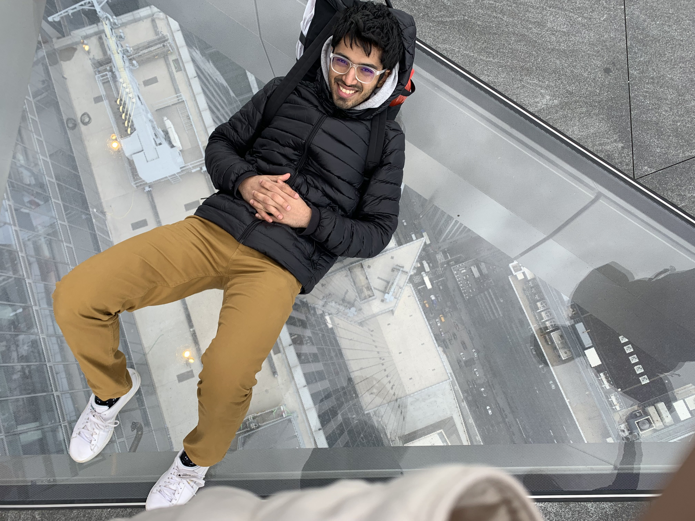

## Research Assistant at [Dartmouth Social Neuroscience Lab](http://www.dartmouth-socialneurolab.com)
[CV](https://drive.google.com/file/d/1re4ELCf2sCyWzUF3h9sbAehXcIgBKgx4/view?usp=sharing)&nbsp;&nbsp;&nbsp;&nbsp;&nbsp;&nbsp;&nbsp;&nbsp;[Twitter](https://twitter.com/SiddhantIyer6)&nbsp;&nbsp;&nbsp;&nbsp;&nbsp;&nbsp;&nbsp;&nbsp;[Contact](mailto:siddhant.kumar.iyer@gmail.com)

[Projects](Projects.md)  
[Philosophies](Philosophies.md)  
[Personal](Personal.md)  

Hello! This site is an attempt to document my research, and more generally, my life beyond the lab. This site isn't complete, but I figured that if I kept waiting for when it was 'done', it would be a long time coming. I have strived to make it (especially the upcoming 'Personal' section) transparent and relatable, noting my failures, struggles, and learnings, both in and out of lab. I hope you enjoy and feel free to reach out.
